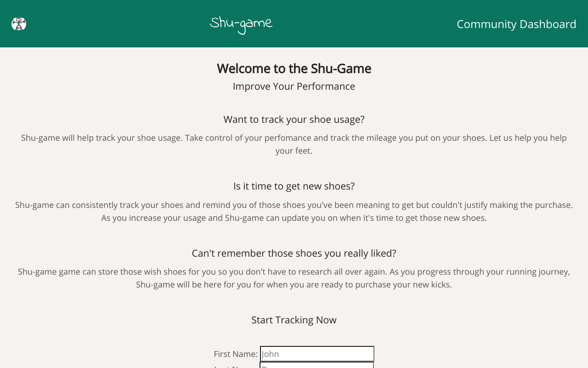

App Name: Shu-game
Live Link: https://shugame-app.now.sh/

This api database holds information for the client side of this application.  The database holds information such as shoes, users, and wishlist items.  This database consist of three tables: users, shoes, and wishlist that all have a relationship with one another though user_id.  

API Documentation:

### usersRouter
| Method | HTTP request | Description |
|--------|:------------:|------------:|
| getAllUsers(get) | /api/users | Gets all the users |
| insertUser(post) | /api/users | Create a new user |
| getById(get) | /api/users/:id | Get a user by the id |

#shoesRouter
Method | HTTP request | Description

---

getAllShoes(get) | /api/shoes | Gets all the shoes
insertShoe(post) | /api/shoe | Create/Add a shoe
getById(get) | /api/shoes/:id | Get a shoe by the id
deleteShoe(delete) | /api/shoes/:id | Delete shoe item
updateShoe(patch) | /api/shoes/:id | update shoe information

#wishRouter
Method | HTTP request | Description

---

getAllWish(get) | /api/wishlist | Gets all the items in wishlist
insertWish(post) | /api/wishlist | Create/Add a wishlist item
getById(get) | /api/wishlist/:wishlist_id | Get a wishlist item by the id
updateWish(patch) | /api/wishlist/:wishlist_id | update wihslist item information

Technologies Used: PostgresSQL, SQL, Node, Javascript, Express, Mocha and Chai 
